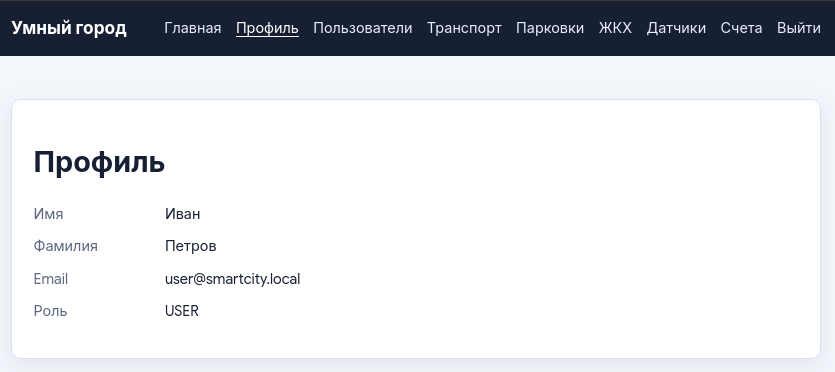
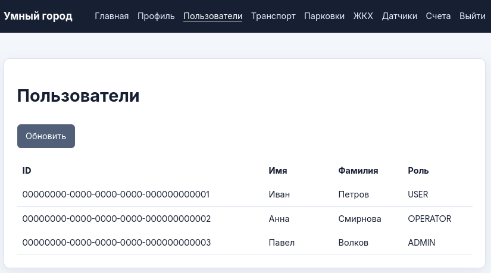
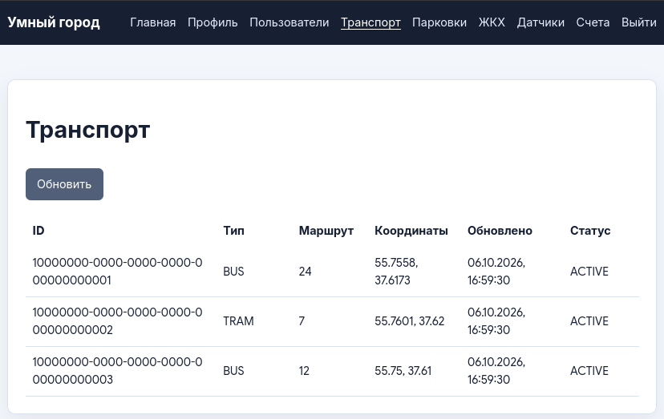
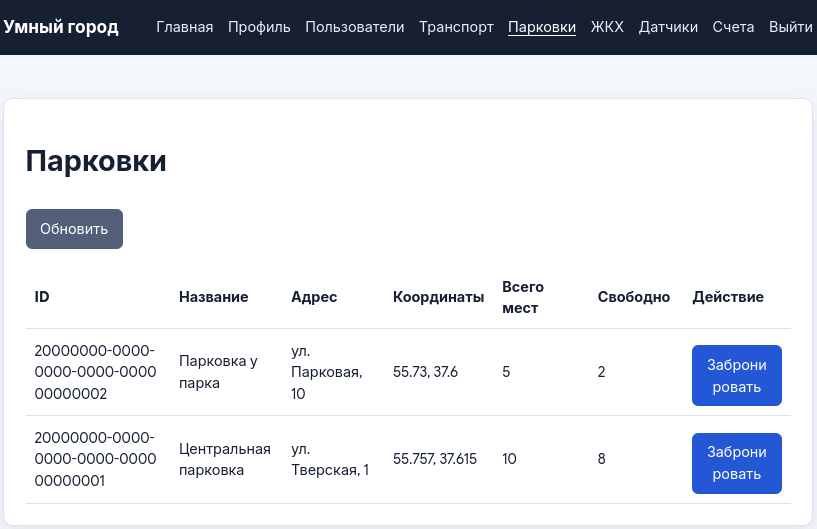
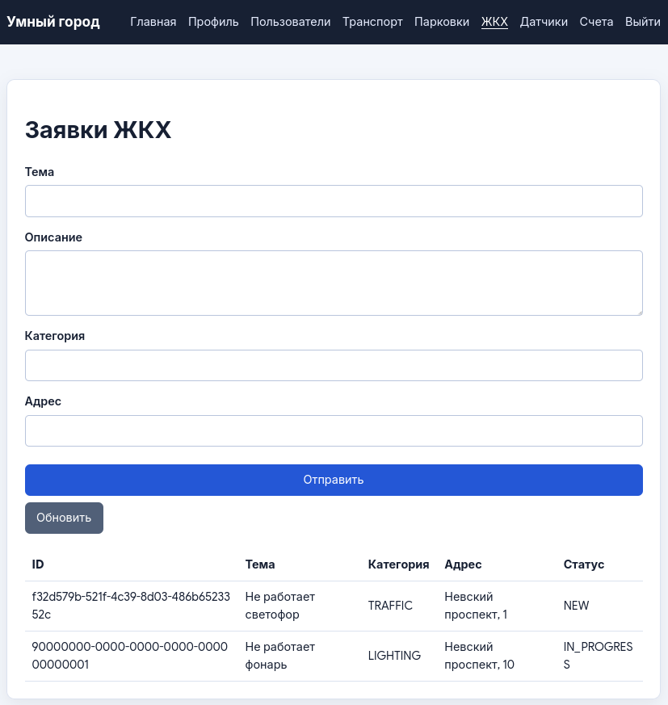
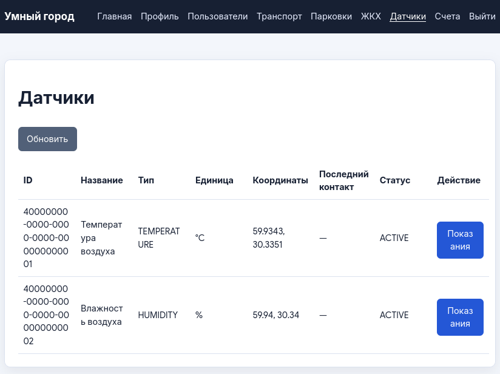

# Умный город

Учебная система управления городской инфраструктурой: шесть независимых
микросервисов с REST API и веб-интерфейсом.

**Стек:** Python 3.12, FastAPI, SQLAlchemy, SQLite, React, Vite, Docker Compose.
Каждый сервис использует собственную БД. Межсервисные вызовы выполняются по HTTP;
авторизация - JWT, ключевые операции записываются в логи.

## Команда

| Участник | Вклад |
|---|---|
| Ашроев Евгений | Identity, Utility, авторизация интерфейса, API-контракт и интеграция |
| Шилов Данил | Transport, Billing, транзакции и схемы их БД |
| Белоножко Иван | Environment, Notification, предметные страницы и схемы их БД |

## Запуск

```bash
cd smart-city
cp .env.example .env  # только если .env ещё нет
docker compose up --build -d
```

Сайт: <http://localhost:5173>. Демонстрационный вход:
`user@smartcity.local`, пароль `demo12345`.

## Предпросмотр


### Главная страница

Обзор неоплаченных счетов, открытых заявок и свободных мест на парковках.


### Авторизация и профиль

Регистрация, вход и просмотр данных аккаунта с его ролью в системе.




### Пользователи

Справочник пользователей: имена и роли жителей, операторов и администраторов.



### Транспорт

Маршруты, координаты и текущее состояние городского транспорта.



### Парковки

Количество свободных мест и бронирование с защитой от повторного запроса.



### Заявки ЖКХ

Создание и просмотр заявок; операторы и администраторы изменяют их статусы.



### Экологические датчики

Состояние датчиков, единицы измерения и история показаний.



### Счета и оплата

Начисления в рублях, сроки и даты оплаты. Оплата демонстрационная, без списания денег.


## Материалы

- [Запуск, роли и настройки](smart-city/README.md).
- [API-контракт](smart-city/docs/API_CONTRACT.md).
- [Схемы шести БД](smart-city/database-design/) и [ZIP для сдачи](smart-city/database-design.zip).
- [Обновление старых БД](smart-city/docs/MIGRATION.md).

Оплата и отправка уведомлений демонстрационные: деньги не списываются,
уведомления сохраняются и записываются в лог.
